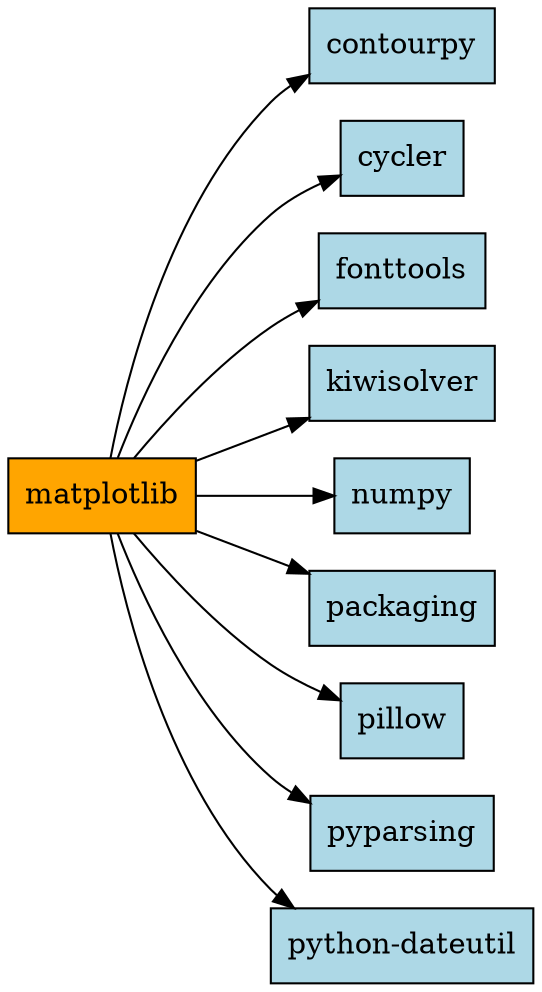
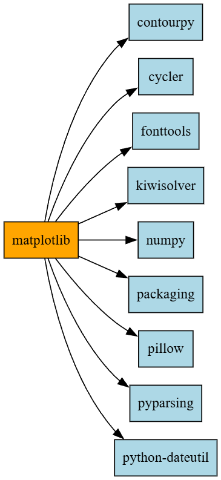
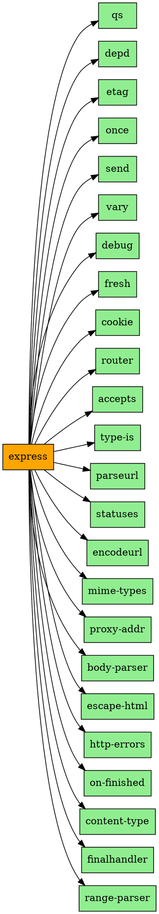

# Практическое занятие №2. Менеджеры пакетов

## Задача 1. Служебная информация о пакете matplotlib

### Команда

```bash
py -3.10 -m pip show matplotlib
```

### Вывод команды (ключевые строки)

```
Name: matplotlib
Version: 3.10.8
Summary: Python plotting package
Home-page:
Author: John D. Hunter, Michael Droettboom
Author-email: Unknown <matplotlib-users@python.org>
License: License agreement for matplotlib versions 1.3.0 and later
Location: c:\users\girlg\appdata\local\programs\python\python310\lib\site-packages
Requires: contourpy, cycler, fonttools, kiwisolver, numpy, packaging, pillow, pyparsing, python-dateutil
Required-by:
```

(Полный вывод включает длинный текст лицензии — опущен для краткости.)

### Разбор основных элементов

| Поле | Значение | Что означает |
|------|----------|--------------|
| Name | matplotlib | Имя пакета |
| Version | 3.10.8 | Версия по SemVer: MAJOR.MINOR.PATCH |
| Summary | Python plotting package | Краткое описание |
| Home-page | (пусто) | Официальный сайт не указан |
| Author | John D. Hunter, Michael Droettboom | Авторы пакета |
| Author-email | matplotlib-users@python.org | Email авторов |
| License | License agreement for matplotlib... | Лицензия |
| Location | c:\users\girlg\...\site-packages | Где лежат файлы пакета |
| Requires | contourpy, cycler, fonttools, kiwisolver, numpy, packaging, pillow, pyparsing, python-dateutil | Зависимости — другие пакеты |
| Required-by | (пусто) | Кто зависит от этого пакета |

### Что такое SemVer

SemVer (Semantic Versioning) — стандарт нумерации версий. Формат: `MAJOR.MINOR.PATCH`.

- MAJOR (3) — несовместимые изменения.
- MINOR (10) — новые функции, обратно совместимые.
- PATCH (8) — исправления ошибок.

Примеры интервалов:
- `^1.2.3` — совместимо с `>=1.2.3` и `<2.0.0`.
- `~1.2.3` — совместимо с `>=1.2.3` и `<1.3.0`.

### Зависимости matplotlib

Поле `Requires` — это список пакетов, от которых зависит `matplotlib`:
- `contourpy` — для контурных графиков.
- `cycler` — для циклических цветов.
- `fonttools` — для работы со шрифтами.
- `kiwisolver` — для решения уравнений раскладки.
- `numpy` — для математических операций.
- `packaging` — для работы с версиями.
- `pillow` — для работы с изображениями.
- `pyparsing` — для парсинга.
- `python-dateutil` — для работы с датами.

Когда устанавливаешь `matplotlib`, `pip` автоматически ставит все эти зависимости.

### Как получить пакет без менеджера пакетов

Менеджер пакетов (`pip`) автоматизирует скачивание и установку. Но можно сделать это вручную:

1. Открыть официальный репозиторий **PyPI**: [pypi.org/project/matplotlib](https://pypi.org/project/matplotlib/)
2. Перейти в раздел **Download files**.
3. Скачать файл `.whl` (wheel) или `.tar.gz` (source) для своей версии Python и ОС.
4. Распаковать архив:
   ```bash
   tar -xzf matplotlib-3.10.8.tar.gz
   cd matplotlib-3.10.8
   ```
5. Установить:
   ```bash
   python setup.py install
   ```
6. Или установить wheel-файл:
   ```bash
   pip install matplotlib-3.10.8-py3-none-any.whl
   ```

**Вывод**: `pip` просто автоматизирует эти шаги. Без него всё делается вручную.


---

## Задача 2. Служебная информация о пакете express

### Команда

```bash
npm view express
```

### Вывод команды (ключевые строки)

```
express@5.2.1 | MIT | deps: 28 | versions: 289
Fast, unopinionated, minimalist web framework
https://expressjs.com/

dependencies:
qs: ^6.14.0, depd: ^2.0.0, etag: ^1.8.1, once: ^1.4.0, send: ^1.1.0,
vary: ^1.1.2, debug: ^4.4.0, fresh: ^2.0.0, cookie: ^0.7.1, router: ^2.2.0,
accepts: ^2.0.0, type-is: ^2.0.1, parseurl: ^1.3.3, statuses: ^2.0.1,
encodeurl: ^2.0.0, mime-types: ^3.0.0, proxy-addr: ^2.0.7, body-parser: ^2.2.1,
escape-html: ^1.0.3, http-errors: ^2.0.0, on-finished: ^2.4.1,
content-type: ^1.0.5, finalhandler: ^2.1.0, range-parser: ^1.2.1
(... 4 more)

maintainers:
- wesleytodd <wes@wesleydodd.com>
- jonchurch <npm@jonchurch.com>
```

### Разбор основных элементов

| Элемент | Значение | Что означает |
|---------|----------|--------------|
| **express@5.2.1** | Имя и версия | Версия по SemVer: MAJOR.MINOR.PATCH |
| **MIT** | Лицензия | MIT License |
| **deps: 28** | Количество зависимостей | 28 других пакетов нужны для работы |
| **versions: 289** | Всего версий | За всю историю выпущено 289 версий |
| **Description** | Fast, unopinionated, minimalist web framework | Краткое описание |
| **Homepage** | https://expressjs.com/ | Официальный сайт |
| **dependencies** | Список зависимостей | Каждая с интервалом версий (`^`) |
| **maintainers** | Сопровождающие | Люди, поддерживающие пакет |

### Что такое `dependencies`

**`dependencies`** — это список пакетов, которые нужны для работы `express`.

Формат: `имя: интервал_версий`.

**Примеры**:
- `qs: ^6.14.0` — нужен пакет `qs` версии `>=6.14.0` и `<7.0.0`.
- `debug: ^4.4.0` — нужен `debug` версии `>=4.4.0` и `<5.0.0`.

**Символ `^`** — «совместимо с»:
- `^6.14.0` = `>=6.14.0` и `<7.0.0`.
- `^1.1.0` = `>=1.1.0` и `<2.0.0`.

Всего у `express` **28 зависимостей** (в выводе показаны 24, ещё 4 скрыты).

### Зависимости express (примеры)

| Пакет | Версия | Что делает |
|-------|--------|-----------|
| `qs` | `^6.14.0` | Парсинг query-строк |
| `debug` | `^4.4.0` | Отладочный вывод |
| `body-parser` | `^2.2.1` | Парсинг тела запроса |
| `cookie` | `^0.7.1` | Работа с cookies |
| `router` | `^2.2.0` | Маршрутизация |
| `mime-types` | `^3.0.0` | Определение MIME-типов |
| `send` | `^1.1.0` | Отправка файлов |

### Как получить пакет без менеджера пакетов

Менеджер пакетов (`npm`) автоматизирует скачивание и установку. Но можно сделать это **вручную**:

1. Открыть официальный репозиторий **npm**: [npmjs.com/package/express](https://www.npmjs.com/package/express).
2. Перейти в раздел **Code** или **Repository** (обычно GitHub).
3. Или скачать tarball напрямую:
   ```
   https://registry.npmjs.org/express/-/express-5.2.1.tgz
   ```
   (эта ссылка есть в выводе команды — поле `dist.tarball`)
4. Распаковать:
   ```bash
   tar -xzf express-5.2.1.tgz
   cd package
   ```
5. Установить зависимости:
   ```bash
   npm install
   ```

**Вывод**: `npm` просто автоматизирует эти шаги. Без него всё делается вручную.


---

## Задача 3. Graphviz-граф зависимостей

### Граф зависимостей matplotlib

**Код DOT**:



**Изображение**:



### Граф зависимостей express

**Код DOT**:



**Изображение**:


